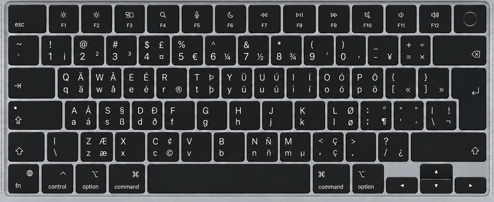

# macOS US International — No Dead Keys for ISO Keyboards

US International keyboard layout for **macOS**, with **no dead keys** and corrected mappings for **physical ISO keyboards**.

## Installation

Paste this into Terminal:

```bash
tmp="$(mktemp -d)" && \
curl -fsSL -o "$tmp/layout.zip" \
  "https://github.com/philippwallrafen/macos-us-intl-no-dead-keys-iso/releases/download/v1.0.0/US-Intl-no-dead-keys-ISO-v1.0.0.zip" && \
unzip -q "$tmp/layout.zip" -d "$tmp" && \
mkdir -p "$HOME/Library/Keyboard Layouts" && \
rm -rf "$HOME/Library/Keyboard Layouts/US Intl no dead keys ISO.bundle" && \
cp -R "$tmp/US Intl no dead keys ISO.bundle" "$HOME/Library/Keyboard Layouts/" && \
rm -rf "$tmp" && \
open "x-apple.systempreferences:com.apple.Keyboard-Settings.extension"
```

Log out and back in, then select **US Intl no dead keys ISO** in **System Settings → Keyboard → Text Input**.

The installer downloads the fixed `v1.0.0` release rather than the mutable `main` branch.

## Compatibility

- macOS
- physical ISO keyboards
- ANSI and JIS keyboards are not the target
- exact macOS version coverage depends on tested and reported hardware

## What this fixes

This project is based on [dnnspaul/macos-us-intl-no-dead-keys](https://github.com/dnnspaul/macos-us-intl-no-dead-keys), but adjusts the two keys that differ on ISO keyboards.

| Key | This layout |
|---|---|
| ISO extra key | `\` / `|` |
| Grave/tilde key | `` ` `` / `~` |

The corrected mapping is applied across the relevant modifier layers.

## AltGr / Option

The upstream US International mappings are preserved.

| Shortcut | Output |
|---|---|
| Option+A | `á` |
| Option+E | `é` |
| Option+I | `í` |
| Option+O | `ó` |
| Option+U | `ú` |
| Option+N | `ñ` |

## Intended for

- macOS
- physical ISO keyboards
- US International users
- users who want accented characters without dead keys

## License

MIT

## Upstream

[dnnspaul/macos-us-intl-no-dead-keys](https://github.com/dnnspaul/macos-us-intl-no-dead-keys)
